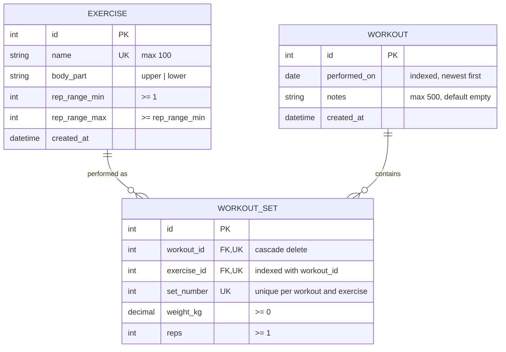
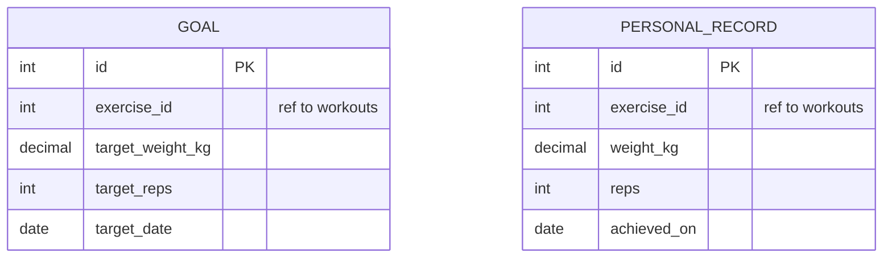

# Data model

**Must match the migrations** in `services/*/migrations/`. Each owner updates their half
in the same PR as the migration. workouts: `001_init.sql`. progress: `001_goals.sql`,
`002_personal_records.sql`.

## workouts database

```mermaid
erDiagram
    EXERCISE ||--o{ WORKOUT_SET : "performed as"
    WORKOUT  ||--o{ WORKOUT_SET : contains
    EXERCISE {
        int id PK
        string name UK "max 100"
        string body_part "upper | lower"
        int rep_range_min ">= 1"
        int rep_range_max ">= rep_range_min"
        datetime created_at
    }
    WORKOUT {
        int id PK
        date performed_on "indexed, newest first"
        string notes "max 500, default empty"
        datetime created_at
    }
    WORKOUT_SET {
        int id PK
        int workout_id FK, UK "cascade delete"
        int exercise_id FK, UK "indexed with workout_id"
        int set_number UK "unique per workout and exercise"
        decimal weight_kg ">= 0"
        int reps ">= 1"
    }
```

Rules enforced in the database: exercise names are unique; `body_part` is `upper` or
`lower`; `1 <= rep_range_min <= rep_range_max`; `weight_kg >= 0`; `reps >= 1`;
`(workout_id, exercise_id, set_number)` is unique. Deleting a workout deletes its sets
(`ON DELETE CASCADE`); an exercise that has sets cannot be deleted. `exercises` and
`workouts` also have `created_at` (UTC); `workout_sets` does not. `weight_kg` is
`DECIMAL(6,2)`, so 62.5 kg is stored exactly.

Text lengths: `exercises.name` is `NVARCHAR(100)` and `workouts.notes` is `NVARCHAR(500)`.
`notes` is never null: it defaults to an empty string.

Indexes: `workouts` is indexed on `performed_on DESC`, for listing the most recent workouts
first; `workout_sets` is indexed on `(exercise_id, workout_id)`, for reading one exercise's
history (what the coach, goals and PRs read).

## progress database

No foreign keys to the workouts database (it is another service). `exercise_id` is a
reference by value, checked through the workouts API.

```mermaid
erDiagram
    GOAL {
        int id PK
        int exercise_id "ref to workouts"
        decimal target_weight_kg
        int target_reps
        date target_date
    }
    PERSONAL_RECORD {
        int id PK
        int exercise_id "ref to workouts"
        decimal weight_kg
        int reps
        date achieved_on
    }
```

`goals` (`001_goals.sql`): `target_weight_kg > 0` (`DECIMAL(6,2)`), `target_reps >= 1`, indexed
on `exercise_id`, plus `created_at` (UTC). A goal means "lift `target_weight_kg` for at least
`target_reps` reps by `target_date`". How close a goal is, is not stored: it is computed from the
workouts history on every request (`GET /goals/{id}/progress`).

`personal_records` (`002_personal_records.sql`): the heaviest `weight_kg` for each exact `reps`
count of an exercise, and the first day it was lifted (`achieved_on`). `(exercise_id, reps)` is
unique, `weight_kg >= 0` (`DECIMAL(6,2)`), `reps >= 1`, plus `created_at` (UTC). The rows of an
exercise are rebuilt from the workouts history each time `GET /exercises/{id}/records` is
called, so a deleted or corrected workout corrects its PRs too. They are stored so `GET /records`
can show the last known PRs while workouts is down, and so the API can mark which PRs are new.
